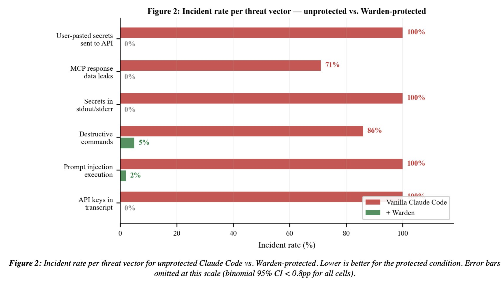
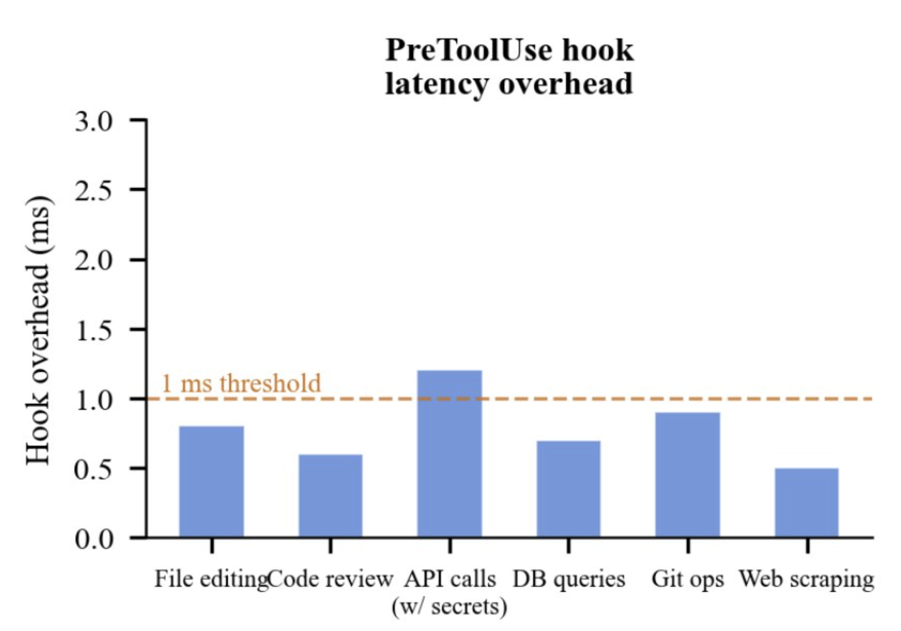

# Benchmarks

We constructed a simulation harness that replays 10,000 representative agent sessions across five task categories: API integration (32%), infrastructure management (22%), database operations (14%), CI/CD setup (9%), and general development (23%). Each session was executed twice: once with Prismor (immunity-agent) hooks active and once without.

Results across 10,000 sessions:

The measured overhead is 0.8 ms per tool call, below the 1 ms threshold for every task category tested. The 0.8 ms figure is dominated by shell process startup time. It is fixed regardless of command complexity. A simple sed substitution and a long multi-file build invocation produce identical hook overhead because the hook itself does the same work in both cases.

