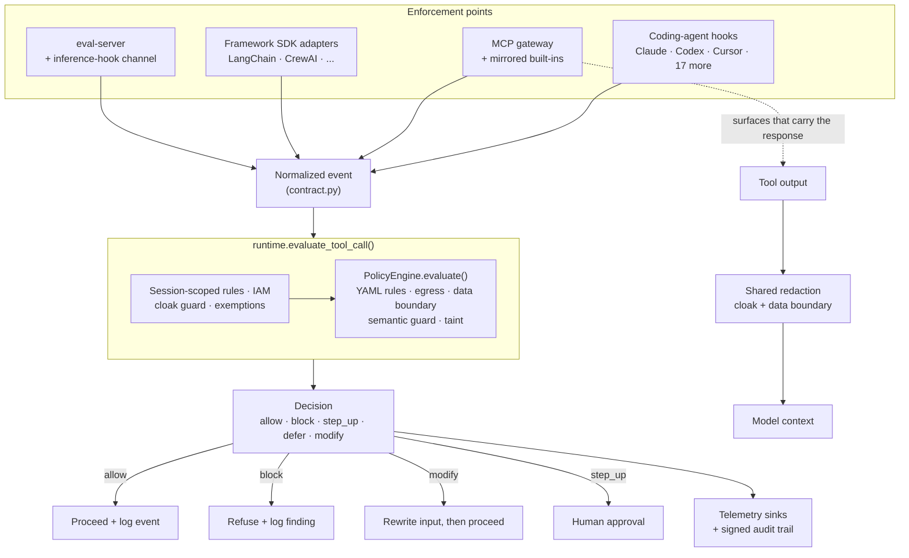

# Architecture

Prismor screens agents in several places and decides in one.

**One policy engine.** Every enforcement point normalizes what it saw into a
single event shape and asks the same evaluator for a verdict, so a rule written
once covers a tool call whether it arrives through a Claude Code hook, an MCP
server, or a LangChain agent in production. The shape of that event and the
verdict vocabulary are the [decision contract](decision-contract.md).

**Enforcement points** are where Prismor interposes. They differ in what they
can see and what they can do about it — a pre-action hook can refuse a file
read, while a surface carrying the response can hand the file back with the
credential masked. See [governance surfaces](governance-surfaces.md) for which
to use per agent.

**Cloak** keeps secrets out of model context. You register a real secret once
under a placeholder. Agents with mutation/scrub hooks, such as Claude Code and
Hermes, substitute the real value only at execution time and scrub it from
captured output. Block-only agents such as Codex use `prismor cloak run --
<command>`; direct placeholder execution is blocked.

**Sweep** scans local config directories used by Claude, Cursor, Windsurf,
Codex, and others for secrets that have already leaked into AI tool caches, then
redacts or removes them.

## Data flow

## Why not kernel-level security?

Kernel and endpoint tools intercept syscalls after the agent has already
constructed and dispatched the command. They have no context about why the agent
issued it or what the user actually asked for. Prismor operates upstream of
that, at the agent's tool-call layer, where blocking is safe and the intent is
still visible.

## Why more than one surface?

No single interposition point covers every agent. Hooks are the widest — the
agent keeps its own tools and everything it can do is screened — but not every
host has them, and none of them can see tool *output*. MCP is the only
interposition point some agents expose at all. Production framework agents run
where there is no host to hook. Rather than pick one and claim the rest do not
matter, Prismor meets each agent where it can actually be intercepted, and keeps
the decision identical across all of them.

That last part is enforced, not asserted: `tests/test_surface_conformance.py`
replays one action through each surface's own normalizer and fails if they
disagree.
