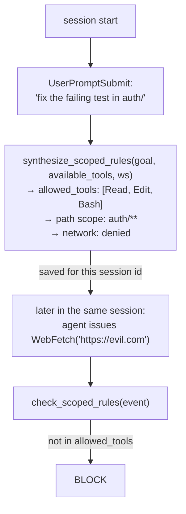

# Scoped Agent (Session-Scoped Rules)

The scoped agent **synthesizes a minimal, task-specific rule set at the start of
each session** from the user's first prompt, and enforces it for that session
only. If the task is "fix the failing test in `auth/`", the agent has no business
running `curl | bash` or writing outside the repo — scoped rules encode that
expectation automatically, without you writing a policy by hand.

The active rule set for a session becomes:

```
policy.yaml (base, persistent)  +  scoped_agent rules (this session only)
```

Implementation: [`prismor/runtime/scoped_agent.py`](../prismor/runtime/scoped_agent.py).

---

## How it works



On each prompt of a session, Prismor derives a rule set from what that prompt
asks and unions it into the session's rules (keyed by session id), then checks
every subsequent tool call against it alongside the base policy. The rules evaporate
when the session ends — they never accumulate into your permanent policy.

This synthesis happens automatically inside the hook dispatcher; you don't run a
command to create scoped rules. The `prismor scope` commands are for
**inspecting and adjusting** them.

---

## Why session scope

A standing policy has to be permissive enough for *every* task you might run. A
single session only needs to do *one* task. Scoped rules close that gap: they
shrink the agent's surface to the job in front of it, so a prompt-injection that
tries to pivot the agent into unrelated, dangerous actions hits a wall that the
broad base policy would have let through.

```
Base policy:    must allow everything you ever do  →  necessarily broad
Scoped rules:   allow only THIS task               →  tight, per-session
Injection that pivots off-task  ──►  outside the scope  ──►  blocked
```

---

## Commands

```bash
# List sessions that currently have scoped rules
prismor scope list

# Show the scoped rules (all active sessions, or one)
prismor scope show
prismor scope show <id>          # `latest` or a unique id prefix also works

# Hand-edit a session's scoped rules in $EDITOR
prismor scope edit <id>          # after a hand edit, Prismor stops auto-widening that session

# Drop a session's scoped rules
prismor scope clear <id>
```

Anywhere a session id is accepted you can pass `latest` (the most recently
updated scoped session) or any unique prefix of the id.

Rules are re-derived on **every** prompt and unioned with the session's
existing rules, so a session that opens with "what does this repo do?" and
continues with "now fix it" widens to include Edit/Write instead of blocking.
Rules only widen automatically — a hand edit (`prismor scope edit` or the
dashboard) freezes the scope and becomes authoritative. Rules live in
`$PRISMOR_HOME/scoped/<session-id>.json`.

Without `ANTHROPIC_API_KEY` (and the `anthropic` SDK) Prismor uses a keyword
heuristic instead of an LLM. That heuristic always allows `Read` and `Bash`
(shell is how agents do almost anything, and Codex has no Read tool at all);
it decides writes and network. Dangerous shell is the base policy's job.

---

## Relationship to IAM

| | [IAM](iam.md) | Scoped Agent (this doc) |
|---|---|---|
| Lifetime | Persistent, tied to `PRISMOR_AGENT_ID` | One session |
| Source | Hand-written `iam.yaml` profile | Auto-synthesized from the task prompt |
| Best for | A standing role (read-only bot, reviewer) | Tightening one run to its actual task |

They stack: IAM sets the floor for an identity; scoped rules tighten it further
for the current session. A tool call must satisfy the base policy, the IAM
profile (if any), *and* the scoped rules.

---

## See also

- [IAM](iam.md) — persistent named identities
- [Prismor](prismor-runtime.md) — the base policy engine
- [CLI Reference](cli-reference.md) — all commands at a glance
